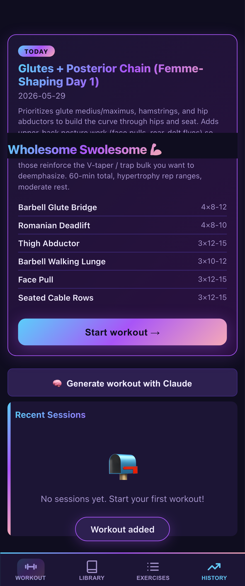
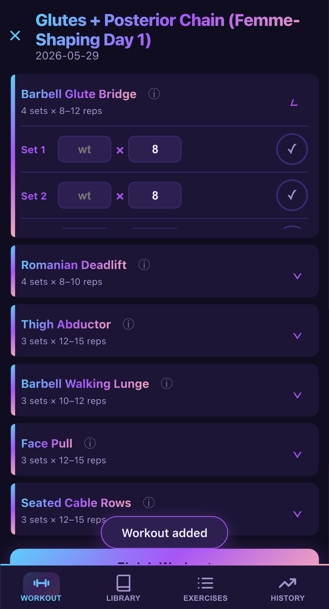
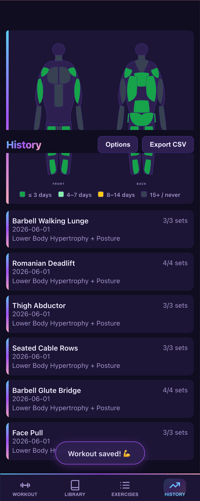

# Wholesome Swolesome 💪

A mobile-first PWA workout tracker built in Rust + Leptos (WASM). Instead of hand-editing a static plan, you set training goals once and **Claude generates each day's workout** based on your goals, recent training history, per-muscle recovery state, cardio targets, and mobility focus.

**Live app:** https://tbaums.github.io/wholesome-swolesome/ · **Tour:** [docs/walkthrough.md](docs/walkthrough.md) — screenshots + the design choices, for sending to peers.

<p align="center">
  
  
  
</p>

## What's in the app

- **Today** — the workout the coach has planned for today (generated locally, or imported from a nightly agent run); per-set inputs pre-fill from your last session
- **Library** — 290 exercises (strength, cardio, plyometrics, stretching, balance) from [free-exercise-db](https://github.com/yuhonas/free-exercise-db) with photos, primary/secondary muscles, and a body silhouette per detail page
- **Exercises** — freeform logging for anything not in a planned workout
- **History** — a body heatmap colored by days-since-last-worked (≤3d / 4–7d / 8–14d / 15+) over a list of past sessions, with per-exercise progress views
- **Options** — set your training goals (primary focus, sessions/week, session minutes, equipment, injuries/notes), cardio + mobility targets (weekly cardio minutes, latest VO2 max, mobility/balance focus), and configure optional GitHub sync

**No backend, ever.** All data lives in `localStorage` (the source of truth) plus an optional `state.json` in a private GitHub repo you own. No server to maintain, no account to sign up for, no API key to store — the "database" is git. [See the walkthrough](docs/walkthrough.md#weird-choices-and-why) for the longer take.

## Using the app, end-to-end

1. **Set your goals.** Open *Options* → fill in the *Training goals* card (primary goal, sessions/week, session minutes, equipment, injuries, notes) and optionally the *Cardio & mobility* card (weekly cardio minutes target, latest VO2 max, mobility/balance focus). These are what the coach plans against.

2. **Get tomorrow's workout.** There are two paths, designed to be interchangeable:

   - **In-app, on demand.** On the Home tab tap *🧠 Generate workout with Claude*. The *Coach Brief* view renders a markdown packet (your goals + cardio/mobility targets + recent training + per-muscle recovery + days-since-stretched + the library reference). Copy it, paste it into any Claude conversation (Claude Code, the Claude mobile app, claude.ai). Optionally paste an Apple Health VO2 max screenshot into the same conversation — Claude will extract the reading into a `vitals` block of the JSON response. Paste that response into the bottom textarea and tap *Import workout*; the workout is scheduled and your VO2 max is updated in one step.
   - **Nightly, unattended.** Run `scripts/coach/coach.sh` once to verify it works, then schedule it via Cowork to run every night. See [scripts/coach/README.md](scripts/coach/README.md) for the full setup, including the `/schedule` invocation. The nightly agent does the same flow as the in-app button, but writes the result back to your sync repo so the app picks it up next time it loads.

3. **Run the workout.** On the Home tab, the *TODAY* card shows the scheduled workout. Tap *Start workout →* to enter the session view. Open each exercise's accordion, enter weight + reps for each set, tap ✓ to log it. The session auto-saves; you can close the browser mid-workout and resume.

4. **Finish.** Tap *Finish Workout*. The session becomes a permanent history entry. The History tab updates the heatmap — the muscles you just worked turn deep green. Back on Home, the TODAY card flips to a DONE state (✓ + workout name + "Generate tomorrow's now…"), so you can't accidentally re-enter the same session.

5. **Repeat.** The coach reads the new history on its next run and adjusts: recently-hit muscles get prescribed less, neglected ones get prioritized, progressive overload is applied within rep ranges.

## Optional: cross-device sync (GitHub backend)

The app can persist state to a private GitHub repo so you can use it from both phone and laptop without re-entering data.

1. Create a private repo, e.g. `you/wholesome-swolesome-data`, with an empty `state.json`.
2. In the app, *Options → Sync (GitHub)*, paste a fine-grained personal-access token with `Contents: read+write` on that repo.
3. Tap *Test connection*, then *Push to GitHub*.
4. On any other device, sign in to the app, paste the same token + repo, tap *Pull from GitHub*.

After that, the app debounces a push 2 seconds after any data change, and pulls fresh state on boot when the remote is newer than the local last-push timestamp.

## Development

```bash
rustup target add wasm32-unknown-unknown
cargo install trunk
trunk serve              # dev server at http://localhost:8081
trunk build --release    # production build into ./dist
```

For deploying to GitHub Pages (sets the correct base URL):

```bash
trunk build --release --public-url /wholesome-swolesome/
```

### Dev container

A devcontainer with the full toolchain (Rust + wasm32, Trunk, wasm-pack, Node, Playwright Chromium, Claude CLI, gh) is in [.devcontainer/](.devcontainer/). Run `./.devcontainer/run.sh` to bring it up and drop into a shell.

### Tests

```bash
# Rust unit tests in WASM (state hydration, schema versions, library parsing)
wasm-pack test --headless --firefox --lib

# Playwright E2E (matches CI)
npx playwright test

# Playwright E2E locally in dev container (Chromium swap for missing WebKit)
npx playwright test --config=playwright.local-chromium.config.ts

# Walkthrough harness — full end-to-end flows with screenshots
npx playwright test --config=playwright.walkthrough.config.ts
```

Walkthrough runs write to `tests/playwright/screenshots/<spec-name>/` (gitignored). A curated subset lives in [`docs/walkthrough/`](docs/walkthrough/) and is what [docs/walkthrough.md](docs/walkthrough.md) embeds — refresh those when you change the walkthrough flow.

## Architecture pointer

For implementation details — module map, state model, schema versions, etc. — see [CLAUDE.md](CLAUDE.md).

## License

MIT — see [LICENSE](LICENSE).
