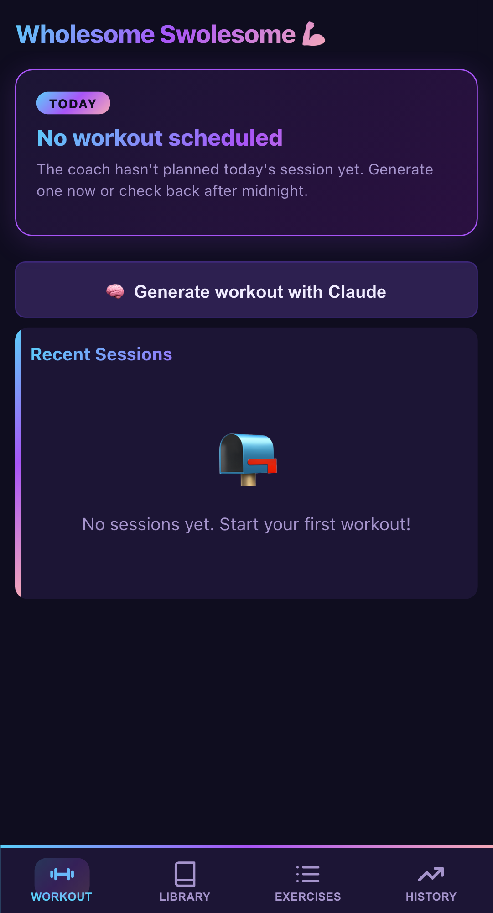
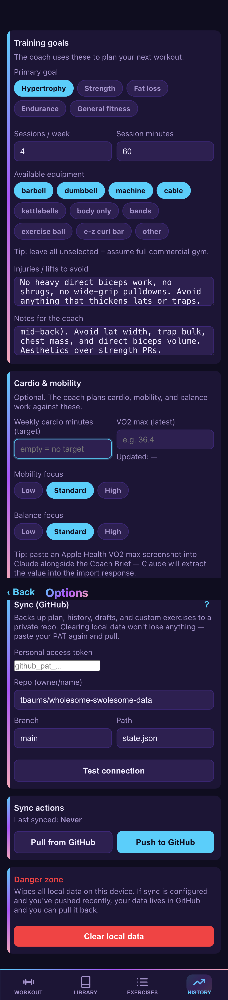
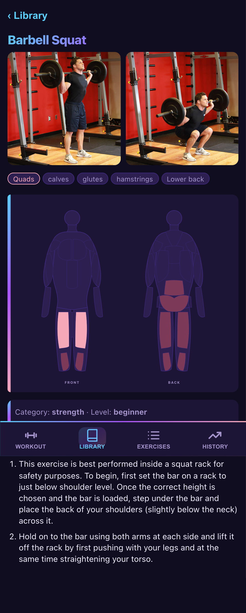
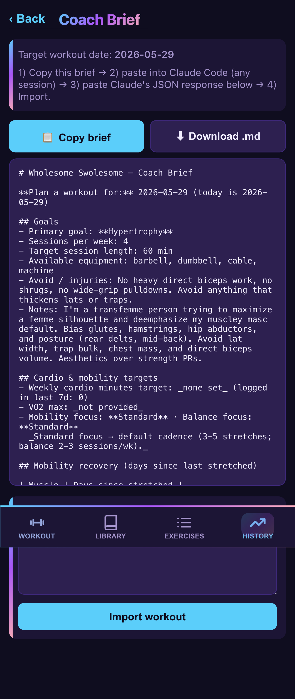
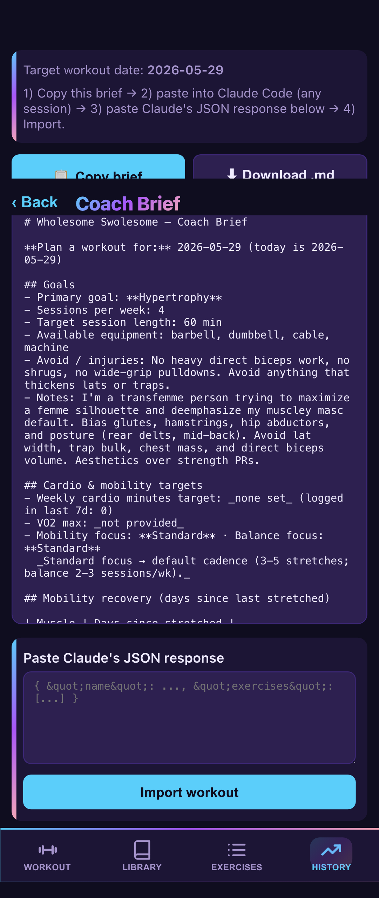

# Wholesome Swolesome — a tour

A mobile-first workout tracker that asks **Claude** to plan each day's session against
your goals, recent history, and per-muscle recovery state — then runs entirely in your
phone's browser with **GitHub as the database**. No servers, no accounts, no app-store
review cycle. This page is the 5-minute pitch.

**Live app:** <https://tbaums.github.io/wholesome-swolesome/> · **Repo:** <https://github.com/tbaums/wholesome-swolesome>

---

## A tour in 8 screenshots

### 1. Empty home

You land on the *Workout* tab. There's no static plan, no calendar, no schedule. The
coach hasn't planned today's session yet, so you tap *Generate workout with Claude*
(or wait for the nightly agent to do it for you). Bottom nav: Workout · Library · Exercises · History.

### 2. Set your goals

One-time setup. Primary goal (Hypertrophy / Strength / Fat loss / Endurance / General
fitness), sessions per week, session minutes, available equipment, injuries to avoid,
freeform coaching notes. Below: **Cardio & mobility** — weekly cardio minutes target,
latest VO2 max (with the date it's from), and Low/Standard/High focus levels for
mobility and balance. Everything below the Training-goals card is optional.

### 3. The exercise library

290 exercises from the [free-exercise-db](https://github.com/yuhonas/free-exercise-db)
dataset — strength, cardio, stretching, balance, plyometrics. Each entry has photos,
primary/secondary muscle chips, a body silhouette colored to show what the lift hits,
and step-by-step instructions. The library is bundled at build time as a static JSON
file; no API calls.

### 4. The Coach Brief

When you tap *Generate workout with Claude*, the app builds a markdown packet
containing everything Claude needs to plan a session: your goals, weekly cardio
minutes hit so far, current VO2 max, mobility/balance focus levels, days-since-
each-muscle-was-worked, days-since-each-muscle-was-stretched, recent training, and
the full exercise library inline (so Claude can only choose valid IDs).

### 5. Paste Claude's response

Copy the brief into any Claude conversation — Claude Code, the Claude mobile app,
claude.ai. (If you also paste an Apple Health VO2-max screenshot into the same
conversation, Claude will extract the reading and include it in the response.) You
get back a strict JSON object describing one workout. Paste it here, tap *Import workout*.

### 6. Today's workout

The imported workout shows up on the *TODAY* card. Title, the coach's one-paragraph
rationale, then the exercise list with target sets × rep ranges. Tap *Start workout →*.

### 7. Logging a session

Each exercise is an accordion. Open it, enter weight + reps for each set, tap ✓ to
log it. Inputs pre-fill with the values from the matching set in your last session,
so you can usually just tap-tap-tap through it. Cardio exercises show min × RPE
instead. Stretching/balance exercises show a duration timer. The session auto-saves
to localStorage — close the browser mid-workout, resume later.

### 8. The heatmap closes the loop

When you finish, you land on *History*. The body silhouette is colored by
**days since each muscle was last worked** — bright green for ≤3 days, fading
through paler greens to grey for "never." Below, the per-exercise session list.
Next time the coach plans for you, this heatmap is the recovery state it reasons
against — recently-hit muscles get prescribed less, neglected ones get prioritized.

---

## Weird choices, and why

### 1. GitHub is the database

There is no server. There is no API. There is no Postgres, no Firebase, no Supabase, no Vercel function. Every byte of user data lives in:

1. `localStorage` in your browser (works offline; this is the source of truth).
2. Optionally, a single `state.json` file in a private GitHub repo you own.

That's it. To "sync across devices," you paste a fine-grained GitHub PAT into Options
and the app uses the [Contents API](https://docs.github.com/en/rest/repos/contents) to
read/write `state.json` with optimistic concurrency (the SHA-as-ETag trick). When the
app boots, it pulls the latest if the remote `updated_at` is newer than what it last
pushed. While you use it, every change schedules a 2-second debounced push back.

**Why this is actually a win:**
- **Zero infra cost.** GitHub already hosts the static app via Pages; the same GitHub
  hosts your data via a private repo. Bill goes from $0 → $0.
- **No backend to maintain.** Ever. Nothing to keep patched, nothing to scale, nothing
  to wake up to at 3am. The "server" is git.
- **You own your data as a JSON file in your own repo.** You can `git clone` it. You
  can pipe it through `jq`. You can write your own analyses. It's not locked in a
  proprietary store you can never get out of.
- **Cross-device sync without an account system.** No signup form, no password reset
  flow, no OAuth callbacks, no "forgot my account" emails. The PAT *is* the auth.
- **Audit trail comes free.** Every workout change is a git commit. `git log` is
  your history.

### 2. The AI plans the workout — and there's no AI *in* the app

This isn't an "AI-powered" wrapper around a chatbot. There's no API key for Anthropic
in the app, no Claude SDK call from the WASM bundle, no streaming response. The app
*generates a markdown brief*; you paste it into whichever Claude conversation you're
already using; you paste the JSON response back. The roundtrip happens entirely
outside the app.

Why this is the right call:
- **No API key to store.** A WASM app can't safely hold a long-lived Anthropic key.
  Pushing the roundtrip to your own Claude session means your existing auth handles
  it — and Anthropic pays for compute, not the app maintainer.
- **You can use whichever Claude surface you like.** Mobile app, claude.ai, Claude
  Code, an Opus session you're already deep into. They're all interchangeable.
- **The same flow handles Apple Health.** Want the coach to know your VO2 max?
  Paste an Apple Health screenshot into the same Claude conversation alongside the
  brief. Claude reads the value off the image, returns it as a top-level `vitals`
  block in the JSON response, and the app's importer updates your goals with it
  (dropping stale source-dates silently).
- **You can also run the same prompt unattended.** `scripts/coach/coach.sh` plus
  Cowork's `/schedule` gives you a nightly agent that pulls your state from GitHub,
  fetches the library, runs the same prompt template, parses the response,
  validates every `library_id` against the bundled library, and pushes the new
  workout back to your data repo. You wake up, open the PWA, today's session is
  there.

### 3. Rust → WASM → PWA on iPhone Safari

The whole frontend is written in [Leptos](https://leptos.dev/) (a reactive Rust UI
framework), compiled to WebAssembly via [Trunk](https://trunkrs.dev/), and deployed
to GitHub Pages. The target is *iPhone Safari, opened from a Home Screen icon*.

Why Rust + WASM + PWA when basically every other production frontend is React?
- **Type safety end-to-end.** The same `ScheduledWorkout` struct serializes to
  localStorage, posts to GitHub, parses from a Claude response, and renders into
  the DOM. No DTO layer, no validation library, no zod schemas — `serde` and
  `Result<T, E>` carry the contract.
- **Mobile bundle size is fine.** The whole app gzips to ~300 KB.
- **It runs offline.** A service worker caches the app shell cache-first; the
  library JSON is network-first with HTTP-cache bypass. You can lose service in
  the gym basement and the PWA still loads and logs.
- **No app-store review.** "Add to Home Screen" installs it like a native app,
  with an icon, splash screen, and standalone window — but you push updates by
  merging to main, no Apple/Google review cycle.

**And the killer iOS-PWA quirk that justifies the no-account design:** Google
OAuth on iOS PWAs is *fundamentally broken*. The OAuth redirect bounces you to
Safari rather than back into your PWA window, breaking the auth round-trip — a
known issue Apple has [years of bug reports on](https://www.google.com/search?q=ios+pwa+google+oauth+broken)
and shows little urgency to fix. Building yet another login flow you'd have to
fight Safari every step of the way would have been miserable. Skipping accounts
entirely and using a GitHub PAT — which the user pastes once and never thinks
about again — sidesteps the whole pile.

---

## Other oddnesses worth knowing about

- **Per-set pre-fill from history.** When you start a workout, each set's weight
  and reps pre-populate from the matching `set_number` of your last completed
  session for that exercise (matched by `library_id`, falling back to exact name).
  Pyramid sets, drop sets, and warm-up sets all preserve their structure across
  sessions.
- **Two body silhouettes, two semantics.** The History heatmap colors by *days
  since strength-worked*. The Coach Brief separately tracks *days since last
  stretched* per muscle, which feeds into mobility prescription. Same body, two
  different views of recovery.
- **Library validation is enforced both client- and server-side.** The coach
  packet inlines every valid exercise ID; the importer rejects any
  `library_id` not in the bundled library; the nightly `coach.sh` aborts the
  push if any returned exercise isn't a real ID. Hallucinated lifts can't
  silently land in your plan.
- **Schema versioning, but only one version.** `state.json` has a
  `schema_version: 2`. Legacy v1 states (with a now-removed `plan` field) still
  deserialize cleanly. New optional fields are added with `#[serde(default)]` so
  rolling forward never breaks existing saved state.
- **CSV export.** The History tab has *Export CSV*, dumping every set ever logged
  (date, day, exercise, set #, reps, weight, completed, duration). If you ever
  outgrow the app, you walk away with a CSV.
- **Walkthrough-as-tests.** This page's screenshots come from
  `tests/playwright/walkthrough_transfemme.spec.ts` — the same e2e test that
  proves the goal → coach → session → history flow works end-to-end. Updating
  the screenshots is just re-running the test.

---

## Try it

Open <https://tbaums.github.io/wholesome-swolesome/> on your phone. On iOS Safari:
tap Share → Add to Home Screen for the standalone-app experience. No signup, no
password — start poking around immediately.

To wire up sync, follow the [README's sync section](../README.md#optional-cross-device-sync-github-backend).
For implementation details — module map, schema, coach loop — see [CLAUDE.md](../CLAUDE.md).
